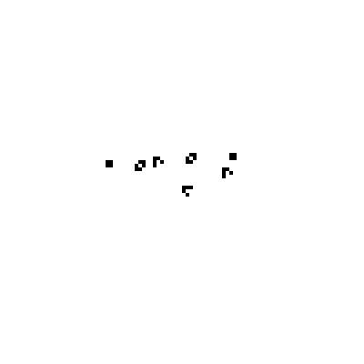
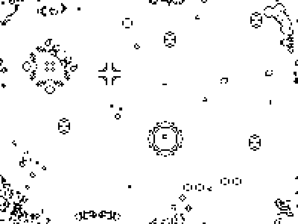

# Игра "Жизнь" (Conway's Game of Life)
**Клеточный автомат, придуманный английским математиком Джоном Конвеем в 1970 году. Реализация на C**
## Ввод/вывод
**Начальная картинка должна быть формата .bmp с глубиной цвета 24 бита и содержать пиксели только черного и белого цветов.
Полученые итерации игры выводятся в указанную в параметрах папку.
**
## Параметры запуска
**1.	_--input input_file.bmp_**
**Где input_file.bmp - монохромная картинка в формате bmp, хранящая начальную ситуация (первое поколение) игры.**
**2.	_--output dir_name\_**
**Название директории для хранения поколений игры в виде монохромной картинки(ОБЯЗАТЕЛЬНО добавить слэш после названия папки)**
**3.	_--max_iter N_**
			**Максимальное число поколений которое может эмулировать программа. Необязательный параметр, по-умолчанию бесконечность**
**4.	_--dump_freq N_**
**Частота с которой программа должно сохранять поколения виде картинки. Необязательный параметр, по-умолчанию равен 1**
## Примеры

